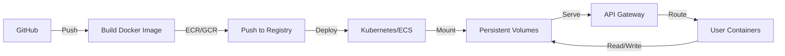

# Cloud Integration — SaaS Deployment Strategy

## Executive Summary

The Ogu CLI-based project compiler can be transformed into a cloud-native SaaS product through two distinct deployment strategies:

1. **Strategy A (Container Per User)** — Recommended MVP approach. Fast to market, minimal code changes, full isolation. 2-4 weeks to production.
2. **Strategy B (Storage Abstraction)** — Long-term scalability. True multi-tenancy, serverless-ready, lower per-user costs. 3-6 months to full adoption.

This document outlines both paths, the recommended phased migration strategy, infrastructure requirements, and cost/security considerations.

---

## Current Architecture

### Codebase Inventory

| Component | Count | Location | Notes |
|-----------|-------|----------|-------|
| Library modules | ~210 | `tools/ogu/commands/lib/` | Core pipeline, infrastructure, agentic OS |
| CLI commands | ~90 | `tools/ogu/commands/` | Registered in `cli.mjs` |
| E2E tests | 125 | `tests/e2e/` | 1,657 test cases, all passing |
| Frontend files | ~80 | `tools/studio/src/` | React TSX components |
| Server routes | ~15 | `tools/studio/server/api/` | Express endpoints |
| Configuration files | ~30 | Root + `.ogu/` | Templates, state, audit logs |

### State Management

- **Runtime state**: `.ogu/` directory (file-based, git-tracked)
- **Structure**: STATE.json, CONTEXT.md, MEMORY.md, audit logs, session files, budget tracking
- **Mutability**: All writes via atomic file operations with fsync
- **Validation**: IR registry enforces contracts on all state mutations
- **Audit trail**: `.ogu/audit/` maintains immutable append-only logs

### Filesystem Access Patterns

- **217 files** with direct filesystem calls
- **~3,700 fs call sites** (read, write, append, mkdir, remove, stat, exists)
- **32 files** with shell execution (execSync, execFileSync)
- **14 files** with process.cwd() assumptions
- **storage-adapter.mjs** exists (46 lines) but currently unused

### Server & Frontend

- **Frontend**: React 19 + TypeScript, webpack bundled, client-side state management
- **Backend**: Express 4.x, running in same process as CLI
- **Communication**: WebSocket for real-time updates, REST for one-off operations
- **Auth**: Currently none (internal tool)
- **Session**: In-memory stores for active compilations

---

## Strategy A: Container Per User (Recommended for MVP)

### Overview

Each user gets an isolated Docker container running the full Ogu stack (CLI + Studio server). Code changes are minimal; the system achieves multi-tenancy through process isolation rather than code changes.

### Architecture Diagram

```
┌─────────────────────────────────────────────────────────────┐
│                      Ogu SaaS Platform                       │
├─────────────────────────────────────────────────────────────┤
│                                                               │
│  ┌──────────────────┐      ┌─────────────────────────────┐  │
│  │   Studio React   │      │   API Gateway / Router      │  │
│  │   (CDN/Static)   │◄─────┤   - Auth middleware        │  │
│  │   - Login page   │      │   - Container discovery    │  │
│  │   - Dashboard    │      │   - Rate limiting          │  │
│  └──────────────────┘      └────────────┬────────────────┘  │
│                                        │                     │
│                            ┌───────────┴──────────────┐     │
│                            │   Container Orchestrator  │     │
│                            │   (K8s / ECS / Fly.io)    │     │
│                            └────────┬─────────┬────────┘     │
│                                     │         │              │
│         ┌───────────────────────────┼─────────┼────────┐     │
│         │                           │         │        │     │
│    ┌────▼─────┐    ┌────────────┐  │   ┌─────▼──┐  ┌─▼────┐│
│    │User A    │    │User B      │  │   │User C  │  │ ...  ││
│    │Container │    │Container   │  │   │Cont    │  │      ││
│    │          │    │            │  │   │        │  │      ││
│    │- .ogu/   │    │- .ogu/     │  │   │- .ogu/ │  │      ││
│    │- Studio  │    │- Studio    │  │   │- Studio│  │      ││
│    │- Express │    │- Express   │  │   │- Expr. │  │      ││
│    └────┬──────┘    └────┬───────┘  │   └──┬─────┘  └──┬───┘│
│         │                │          │      │           │    │
│    ┌────▼────────────────▼──────────▼──────▼───────────▼─┐  │
│    │       Persistent Volume Storage (EBS/EFS)          │  │
│    │       User A: /data/userA/.ogu                      │  │
│    │       User B: /data/userB/.ogu                      │  │
│    │       User C: /data/userC/.ogu                      │  │
│    └───────────────────────────────────────────────────┘  │
│                                                               │
│  ┌──────────────────┐  ┌────────────┐  ┌────────────────┐  │
│  │ User Management  │  │ PostgreSQL │  │ Redis Sessions │  │
│  │ Service          │  │ - Users    │  │ - Auth tokens  │  │
│  │ - Register       │  │ - Orgs     │  │ - Subscriptions│  │
│  │ - Login          │  │ - Billing  │  │                │  │
│  │ - Profile        │  │            │  │                │  │
│  └──────────────────┘  └────────────┘  └────────────────┘  │
│                                                               │
│  ┌──────────────────────────────────────────────────────┐  │
│  │          Stripe Integration (Billing)                │  │
│  │          - Subscription management                   │  │
│  │          - Usage tracking                            │  │
│  │          - Invoice generation                        │  │
│  └──────────────────────────────────────────────────────┘  │
│                                                               │
└─────────────────────────────────────────────────────────────┘
```

### Component Specifications

#### 1. Auth Middleware (Express)

```typescript
// tools/studio/server/middleware/auth.ts
interface AuthRequest extends express.Request {
  user: {
    id: string
    email: string
    org_id: string
    subscription_tier: 'free' | 'pro' | 'enterprise'
  }
  container_id: string
}

// JWT validation on all /api/* routes
// Extract from Authorization header: Bearer <token>
// Validate signature + expiration
// Attach user context to request
// Reject if token invalid or expired

// Response: 401 Unauthorized if token missing/invalid
// Refresh token logic: long-lived refresh tokens in httpOnly cookies
```

#### 2. User Management Service

```typescript
// tools/ogu/commands/lib/user-management.mjs
interface User {
  id: string           // UUID
  email: string        // Unique
  password_hash: string
  org_id: string       // FK to organizations
  created_at: Date
  last_login: Date
  api_keys: { key: string; name: string }[]
  subscription_tier: 'free' | 'pro' | 'enterprise'
  storage_quota_gb: number
  billing_contact: string
}

// Functions:
// - register(email, password, org_name) → User
// - login(email, password) → { access_token, refresh_token }
// - refresh_token(refresh_token) → { access_token }
// - get_profile(user_id) → User
// - update_profile(user_id, updates) → User
// - create_api_key(user_id, name) → string
// - revoke_api_key(user_id, key_id) → void
// - list_api_keys(user_id) → ApiKey[]
```

#### 3. Container Orchestrator

```typescript
// tools/ogu/commands/lib/container-orchestrator.mjs
interface ContainerSession {
  id: string           // UUID, used in routing
  user_id: string
  container_id: string // Docker/K8s container ID
  port: number         // Port inside cluster
  status: 'starting' | 'ready' | 'stopping' | 'failed'
  created_at: Date
  last_activity: Date
  allocated_resources: {
    cpu: string        // "500m"
    memory: string     // "2Gi"
  }
}

// Methods:
// - spawn_container(user_id) → ContainerSession
// - route_request(user_id, path, method, body) → Response
//   (finds active container, proxies request with JWT token in header)
// - get_container(user_id) → ContainerSession | null
// - destroy_container(session_id) → void
// - list_active_containers() → ContainerSession[]
// - health_check(session_id) → boolean
// - auto_restart_failed(session_id) → void
```

**Orchestration options**:
- **Kubernetes**: StatefulSet for containers, Service for networking, PersistentVolumeClaim for storage
- **AWS ECS**: Fargate for compute, EFS for storage, ALB for routing
- **Fly.io**: Machines API for containers, Volumes for storage, built-in routing

#### 4. Persistent Storage Manager

```typescript
// tools/ogu/commands/lib/persistent-storage.mjs
interface StorageMount {
  user_id: string
  volume_id: string    // EBS volume ID or K8s PVC name
  mount_path: string   // Inside container: /root/.ogu
  size_gb: number
  iops: number         // For EBS
  encrypted: boolean
}

// Methods:
// - provision_volume(user_id, size_gb) → StorageMount
// - mount_to_container(volume_id, container_id) → void
// - get_usage(user_id) → { used_gb: number, quota_gb: number }
// - expand_volume(volume_id, new_size_gb) → void
// - backup_snapshot(volume_id) → string (snapshot_id)
// - restore_from_snapshot(snapshot_id, new_volume_id) → void
// - cleanup_old_volumes(user_id, keep_snapshots: number) → void
```

**Storage recommendations**:
- **AWS ECS + EFS**: EFS Auto Scaling, lifecycle policies for old backups
- **K8s**: Persistent Volume Claims with storage class for performance tier
- **Fly.io**: Persistent volumes with automatic backups

#### 5. Billing Service (Stripe)

```typescript
// tools/ogu/commands/lib/billing-service.mjs
interface SubscriptionTier {
  tier: 'free' | 'pro' | 'enterprise'
  price_monthly_usd: number
  storage_gb: number
  concurrent_compilations: number
  api_rate_limit_rpm: number
  features: string[]
}

// Methods:
// - create_subscription(user_id, tier) → { subscription_id, payment_url }
// - cancel_subscription(user_id) → void
// - update_subscription(user_id, new_tier) → void
// - get_current_usage(user_id) → { storage_gb, compilations_count, api_calls }
// - get_invoice(invoice_id) → Invoice
// - list_invoices(user_id) → Invoice[]
// - charge_usage(user_id) → void (monthly metered billing)

// Webhooks:
// - on_charge_succeeded(event) → update subscription status
// - on_charge_failed(event) → notify user, optionally suspend
// - on_customer_updated(event) → sync user profile
```

**Stripe integration**:
- Subscriptions for base tier (free/pro/enterprise)
- Metered billing for overage (storage beyond quota, API calls beyond limit)
- Webhook handlers for payment events
- Dunning logic: retry failed charges, send reminders, suspend on non-payment

#### 6. API Gateway / Request Router

```typescript
// tools/studio/server/middleware/gateway.ts
// Routes all requests from frontend to correct user container

app.use('/api/*', authenticateJWT, async (req, res) => {
  // 1. Extract user_id from JWT
  const user_id = req.user.id

  // 2. Get or spawn container
  let session = await containerOrch.get_container(user_id)
  if (!session) {
    session = await containerOrch.spawn_container(user_id)
  }

  // 3. Check rate limits
  const usage = await billingService.get_current_usage(user_id)
  if (usage.api_calls >= req.user.api_rate_limit) {
    return res.status(429).json({ error: 'Rate limit exceeded' })
  }

  // 4. Proxy request to container
  const response = await fetch(`http://localhost:${session.port}${req.path}`, {
    method: req.method,
    headers: { ...req.headers, 'X-Ogu-User-ID': user_id },
    body: req.body ? JSON.stringify(req.body) : undefined
  })

  // 5. Return response
  return res.status(response.status).json(await response.json())
})
```

#### 7. Health Monitoring & Auto-Restart

```typescript
// tools/ogu/commands/lib/health-monitor.mjs
const HEALTH_CHECK_INTERVAL_MS = 30000
const RESTART_THRESHOLD_FAILURES = 3

async function monitor_containers() {
  const containers = await containerOrch.list_active_containers()

  for (const session of containers) {
    try {
      const healthy = await containerOrch.health_check(session.id)

      if (!healthy) {
        session.consecutive_failures = (session.consecutive_failures || 0) + 1

        if (session.consecutive_failures >= RESTART_THRESHOLD_FAILURES) {
          await containerOrch.auto_restart_failed(session.id)
          session.consecutive_failures = 0
        }
      } else {
        session.consecutive_failures = 0
      }
    } catch (err) {
      auditEmitter.log_error('health_check_failed', { session_id: session.id, error: err.message })
    }
  }
}

// Run every 30 seconds
setInterval(monitor_containers, HEALTH_CHECK_INTERVAL_MS)
```

### What Stays Unchanged

- **All 210 library modules** — No modifications needed
- **All 90 CLI commands** — Work exactly as before
- **Studio frontend** — Add login page + auth header handling only
- **Studio server** — Add auth middleware, gateway proxy, no core logic changes
- **All .ogu/ file operations** — Filesystem calls work unchanged inside container
- **IR validation** — Contract enforcement unchanged

### What Gets Built

| Component | Effort | LOC | Risk |
|-----------|--------|-----|------|
| Auth middleware | 1 week | 150 | Low |
| User management service | 1 week | 300 | Low |
| Container orchestrator | 1.5 weeks | 400 | Medium |
| Persistent storage manager | 1 week | 250 | Medium |
| Billing service | 1 week | 350 | Low |
| API gateway | 3 days | 200 | Low |
| Health monitoring | 3 days | 150 | Low |
| Frontend login page | 2 days | 100 | Low |
| **Total** | **2-4 weeks** | **~1,900** | **Low-Medium** |

### Deployment Pipeline



### Kubernetes Deployment Manifest Example

```yaml
# tools/deploy/k8s/user-container.yaml
apiVersion: apps/v1
kind: StatefulSet
metadata:
  name: ogu-user-containers
spec:
  serviceName: ogu-user-containers
  replicas: 1  # Scales via container orchestrator
  selector:
    matchLabels:
      app: ogu-user-container
  template:
    metadata:
      labels:
        app: ogu-user-container
        user_id: "{{ user_id }}"
    spec:
      containers:
      - name: ogu-studio
        image: registry.example.com/ogu:latest
        ports:
        - containerPort: 3000
        resources:
          requests:
            cpu: 500m
            memory: 2Gi
          limits:
            cpu: 2000m
            memory: 4Gi
        volumeMounts:
        - name: user-data
          mountPath: /root/.ogu
        - name: git-config
          mountPath: /root/.gitconfig
          subPath: .gitconfig
      volumes:
      - name: git-config
        configMap:
          name: git-config
  volumeClaimTemplates:
  - metadata:
      name: user-data
    spec:
      accessModes: [ "ReadWriteOnce" ]
      storageClassName: fast-ssd
      resources:
        requests:
          storage: 100Gi
```

### Container Image (Dockerfile)

```dockerfile
FROM node:20-alpine

WORKDIR /app

# Copy codebase
COPY . .

# Install dependencies
RUN npm ci

# Expose Studio server port
EXPOSE 3000

# Health check
HEALTHCHECK --interval=30s --timeout=10s --start-period=40s --retries=3 \
  CMD node -e "require('http').get('http://localhost:3000/health', (r) => {if (r.statusCode !== 200) throw new Error(r.statusCode)})"

# Start Studio server + CLI ready
CMD ["node", "tools/studio/server/index.ts"]
```

### Pros & Cons

**Advantages**:
- ✅ Fast to market (2-4 weeks)
- ✅ Zero risk to existing code — all 210 modules unchanged
- ✅ Full isolation between users — no cross-tenant data leaks possible
- ✅ Simple debugging — each user has their own environment
- ✅ Easy to scale horizontally (just spawn more containers)
- ✅ No async conversion needed
- ✅ Trivial to add new CLI commands — they work in SaaS automatically

**Disadvantages**:
- ❌ Higher resource cost per user (~$5-15/month per container)
- ❌ Cold start latency when spawning container (5-30 seconds)
- ❌ Container per user doesn't scale beyond ~5,000 users cheaply
- ❌ Requires container orchestration infrastructure (K8s or ECS expertise)
- ❌ Node.js process replication overhead (one process per user)

### Cost Analysis (Strategy A)

For 100 active users:

| Component | Cost/Month | Notes |
|-----------|-----------|-------|
| Container compute (ECS Fargate) | $3,000 | 100 × 500m CPU × 2Gi RAM |
| Persistent storage (EFS) | $800 | 100 × 100Gi @ $8/Gi/mo + operations |
| PostgreSQL (RDS) | $300 | t3.small multi-AZ |
| Redis (ElastiCache) | $150 | cache.t3.micro |
| NAT Gateway / Traffic | $450 | Data transfer + NAT |
| CDN (CloudFront) | $100 | Frontend assets |
| Stripe processing | $500 | 2.9% + $0.30 per transaction |
| LLM API pass-through | Variable | Cost to user (no markup shown) |
| **Total Infrastructure** | **~$5,300** | **~$53 per user/month** |
| **Pricing to user** | $15-50 | Tier-dependent subscription |
| **Gross margin** | 50-70% | Assuming $50 avg ARPU |

**Break-even**: ~100 active users (assuming $40 ARPU, 70% gross margin).

---

## Strategy B: Storage Abstraction Layer (Long-term Scaling)

### Overview

Replace all direct filesystem calls with a pluggable `StorageAdapter` interface. This enables true multi-tenancy on a single shared server, massive cost reduction at scale, and serverless deployment options.

### Architecture Diagram

```
┌────────────────────────────────────────────────────────────┐
│                    Ogu SaaS (Strategy B)                   │
├────────────────────────────────────────────────────────────┤
│                                                              │
│  ┌──────────────────┐      ┌────────────────────────────┐  │
│  │  Studio React    │      │ Shared API Server          │  │
│  │  (CDN/Static)    │◄─────┤ - Auth middleware          │  │
│  │  - Login page    │      │ - Route to handler         │  │
│  │  - Dashboard     │      │ - Multi-tenant context     │  │
│  └──────────────────┘      └────────┬───────────────────┘  │
│                                     │                       │
│         ┌───────────────────────────┴────────────────────┐  │
│         │                                                │  │
│    ┌────▼──────────────────────────────────────────┐    │  │
│    │    Handler Layer (All 90 commands)            │    │  │
│    │    - compile, doctor, context, etc.           │    │  │
│    │    - All 210 library modules                  │    │  │
│    │    - Use StorageAdapter abstraction           │    │  │
│    │    - Tenant context injected automatically    │    │  │
│    └────┬──────────────────────────────────────────┘    │  │
│         │                                                │  │
│    ┌────▼──────────────────────────────────────────┐    │  │
│    │    StorageAdapter Interface                   │    │  │
│    │    - read(path, options?)                     │    │  │
│    │    - write(path, content, options?)           │    │  │
│    │    - append(path, content, options?)          │    │  │
│    │    - exists(path)                             │    │  │
│    │    - remove(path)                             │    │  │
│    │    - list(dir)                                │    │  │
│    │    - mkdir(dir)                               │    │  │
│    │    - stat(path)                               │    │  │
│    │    - watch(path, callback)  ← async           │    │  │
│    └────┬──────────────────────────────────────────┘    │  │
│         │                                                │  │
│    ┌────┴──────────────────┬──────────────┬───────┐    │  │
│    │                       │              │       │    │  │
│ ┌──▼──┐  ┌─────────┐  ┌────▼────┐  ┌────▼──┐  ┌──▼──┐ │  │
│ │Local│  │S3Adapter│  │Postgres │  │SQLite │  │Mem  │ │  │
│ │FS   │  │         │  │Adapter  │  │Adapter│  │Adapt│ │  │
│ │Adap │  │         │  │         │  │       │  │     │ │  │
│ │     │  │         │  │         │  │       │  │     │ │  │
│ └────┘  └─────────┘  └─────────┘  └───────┘  └─────┘ │  │
│    │         │             │            │        │    │  │
│    │         │         ┌───▼──────┐    │        │    │  │
│    │         │         │PostgreSQL│    │        │    │  │
│    │         │         │/DynamoDB │    │        │    │  │
│    │         │         └──────────┘    │        │    │  │
│    │         │                         │        │    │  │
│    │         └────────────┬────────────┘        │    │  │
│    │                      │                     │    │  │
│ ┌──▼──────────────────────▼─────────────────────▼──┐ │  │
│ │  Tenant Context (Injected into all operations)  │ │  │
│ │  - org_id (extracted from JWT)                  │ │  │
│ │  - paths scoped to /orgs/{org_id}/*             │ │  │
│ │  - storage ops checked against RBAC             │ │  │
│ └─────────────────────────────────────────────────┘ │  │
│                                                      │  │
│  ┌────────────────────────────────────────────────┐ │  │
│  │  Job Queue (for CLI commands)                  │ │  │
│  │  - celery / Bull.js / AWS SQS                  │ │  │
│  │  - Spawn shell commands with sandboxing        │ │  │
│  │  - 32 files with execSync → async job queue    │ │  │
│  └────────────────────────────────────────────────┘ │  │
│                                                      │  │
│  ┌────────────────────────────────────────────────┐ │  │
│  │  Same Billing & Auth as Strategy A             │ │  │
│  │  - User management, subscriptions, etc.        │ │  │
│  └────────────────────────────────────────────────┘ │  │
│                                                      │  │
└──────────────────────────────────────────────────────┘  │
```

### StorageAdapter Interface Specification

```typescript
// tools/ogu/commands/lib/storage-adapter.mjs
export interface StorageAdapter {
  /**
   * Read file as string. Tenant-scoped automatically.
   * @param path Relative path (e.g., ".ogu/STATE.json")
   * @param options Optional: { encoding?: 'utf8' | 'binary', timeout_ms?: number }
   * @returns File contents
   * @throws ENOENT if file doesn't exist
   */
  read(path: string, options?: ReadOptions): Promise<string>

  /**
   * Write file atomically. Tenant-scoped automatically.
   * @param path Relative path
   * @param content File contents
   * @param options Optional: { create_dirs?: boolean, fsync?: boolean }
   * @throws Error if write fails or quota exceeded
   */
  write(path: string, content: string, options?: WriteOptions): Promise<void>

  /**
   * Append to file (atomic append). For audit logs, etc.
   * @param path Relative path
   * @param content Content to append
   * @returns New file size
   */
  append(path: string, content: string): Promise<number>

  /**
   * Check if file/dir exists.
   * @param path Relative path
   * @returns true if exists, false otherwise
   */
  exists(path: string): Promise<boolean>

  /**
   * Delete file or directory.
   * @param path Relative path
   * @param options Optional: { recursive?: boolean, force?: boolean }
   */
  remove(path: string, options?: RemoveOptions): Promise<void>

  /**
   * List directory contents.
   * @param dir Relative path to directory
   * @returns Array of filenames (not full paths)
   */
  list(dir: string): Promise<string[]>

  /**
   * Create directory (including parents if needed).
   * @param dir Relative path
   */
  mkdir(dir: string, options?: MkdirOptions): Promise<void>

  /**
   * Get file metadata.
   * @param path Relative path
   * @returns { size: number, mtime: Date, isDirectory: boolean }
   */
  stat(path: string): Promise<FileStat>

  /**
   * Watch for file changes (optional, for real-time updates).
   * @param path Relative path
   * @param callback Fired on change/delete
   * @returns Unsubscribe function
   */
  watch(path: string, callback: (event: WatchEvent) => void): () => void

  /**
   * Transaction/batch operations (optional).
   * @param operations Array of { op: 'read'|'write'|'delete', path, content? }
   * @returns Results array
   */
  batch(operations: BatchOperation[]): Promise<BatchResult[]>

  /**
   * Get storage quota and current usage.
   * @returns { quota_bytes: number, used_bytes: number }
   */
  quota(): Promise<{ quota_bytes: number; used_bytes: number }>
}

// Initialization: StorageAdapter is instantiated per request with tenant context
function create_adapter_for_tenant(tenant_id: string, type: 'local' | 's3' | 'postgres'): StorageAdapter {
  switch (type) {
    case 'local':
      return new LocalFSAdapter(tenant_id)
    case 's3':
      return new S3Adapter(tenant_id)
    case 'postgres':
      return new PostgresAdapter(tenant_id)
    default:
      throw new Error(`Unknown adapter type: ${type}`)
  }
}

// Usage in handlers:
export async function compile_handler(req: Request, res: Response) {
  const storage = create_adapter_for_tenant(req.user.org_id, 's3')
  const spec = await storage.read('.ogu/Spec.md')
  // ... rest of compile logic
}
```

### Implementation: LocalFSAdapter (Reference)

```typescript
// tools/ogu/commands/lib/adapters/local-fs-adapter.mjs
import fs from 'fs/promises'
import path from 'path'

export class LocalFSAdapter {
  constructor(tenant_id) {
    this.tenant_id = tenant_id
    this.base_path = `/data/tenants/${tenant_id}`
  }

  async read(file_path, options = {}) {
    const full_path = path.join(this.base_path, file_path)
    const content = await fs.readFile(full_path, options.encoding || 'utf8')
    return content
  }

  async write(file_path, content, options = {}) {
    const full_path = path.join(this.base_path, file_path)

    if (options.create_dirs) {
      await fs.mkdir(path.dirname(full_path), { recursive: true })
    }

    // Atomic write via temp file
    const temp_path = `${full_path}.tmp.${Date.now()}`
    await fs.writeFile(temp_path, content, 'utf8')
    await fs.rename(temp_path, full_path)

    // fsync if requested
    if (options.fsync) {
      // Node.js doesn't expose fsync easily; use os.fsync() or fs.open() + fsync()
    }
  }

  async append(file_path, content) {
    const full_path = path.join(this.base_path, file_path)
    await fs.appendFile(full_path, content, 'utf8')
    const stat = await fs.stat(full_path)
    return stat.size
  }

  async exists(file_path) {
    const full_path = path.join(this.base_path, file_path)
    try {
      await fs.access(full_path)
      return true
    } catch {
      return false
    }
  }

  async remove(file_path, options = {}) {
    const full_path = path.join(this.base_path, file_path)
    const stat = await fs.stat(full_path)

    if (stat.isDirectory()) {
      if (options.recursive) {
        await fs.rm(full_path, { recursive: true, force: options.force })
      } else {
        await fs.rmdir(full_path)
      }
    } else {
      await fs.unlink(full_path)
    }
  }

  async list(dir_path) {
    const full_path = path.join(this.base_path, dir_path)
    return await fs.readdir(full_path)
  }

  async mkdir(dir_path, options = {}) {
    const full_path = path.join(this.base_path, dir_path)
    await fs.mkdir(full_path, { recursive: true })
  }

  async stat(file_path) {
    const full_path = path.join(this.base_path, file_path)
    const stat = await fs.stat(full_path)
    return {
      size: stat.size,
      mtime: stat.mtime,
      isDirectory: stat.isDirectory()
    }
  }

  watch(file_path, callback) {
    const full_path = path.join(this.base_path, file_path)
    const watcher = fs.watch(full_path, (event, filename) => {
      callback({ event, path: file_path })
    })
    return () => watcher.close()
  }

  async quota() {
    // Simplified; real implementation queries filesystem quota
    return { quota_bytes: 1e12, used_bytes: 1e11 }
  }
}
```

### Implementation: S3Adapter (For SaaS)

```typescript
// tools/ogu/commands/lib/adapters/s3-adapter.mjs
import { S3Client, GetObjectCommand, PutObjectCommand, ListObjectsV2Command, DeleteObjectCommand, HeadObjectCommand } from '@aws-sdk/client-s3'
import { CloudFront } from '@aws-sdk/client-cloudfront'

export class S3Adapter {
  constructor(tenant_id) {
    this.tenant_id = tenant_id
    this.bucket = process.env.OGU_S3_BUCKET
    this.prefix = `tenants/${tenant_id}`
    this.client = new S3Client({ region: process.env.AWS_REGION })
  }

  async read(file_path, options = {}) {
    const key = `${this.prefix}/${file_path}`

    try {
      const response = await this.client.send(new GetObjectCommand({
        Bucket: this.bucket,
        Key: key
      }))

      const body = await response.Body.transformToString('utf8')
      return body
    } catch (err) {
      if (err.name === 'NoSuchKey') {
        throw new Error(`ENOENT: ${file_path}`)
      }
      throw err
    }
  }

  async write(file_path, content, options = {}) {
    const key = `${this.prefix}/${file_path}`

    try {
      await this.client.send(new PutObjectCommand({
        Bucket: this.bucket,
        Key: key,
        Body: content,
        ContentType: 'text/plain',
        ServerSideEncryption: 'AES256',
        Metadata: {
          'tenant-id': this.tenant_id,
          'written-at': new Date().toISOString()
        }
      }))
    } catch (err) {
      throw new Error(`Write failed for ${file_path}: ${err.message}`)
    }
  }

  async append(file_path, content) {
    // S3 doesn't support atomic append; fetch, modify, write back
    let existing = ''
    if (await this.exists(file_path)) {
      existing = await this.read(file_path)
    }

    const updated = existing + content
    await this.write(file_path, updated)
    return updated.length
  }

  async exists(file_path) {
    const key = `${this.prefix}/${file_path}`

    try {
      await this.client.send(new HeadObjectCommand({
        Bucket: this.bucket,
        Key: key
      }))
      return true
    } catch (err) {
      if (err.name === 'NotFound') return false
      throw err
    }
  }

  async remove(file_path, options = {}) {
    const key = `${this.prefix}/${file_path}`

    if (options.recursive) {
      // List all objects under this prefix and delete
      const response = await this.client.send(new ListObjectsV2Command({
        Bucket: this.bucket,
        Prefix: key
      }))

      for (const obj of response.Contents || []) {
        await this.client.send(new DeleteObjectCommand({
          Bucket: this.bucket,
          Key: obj.Key
        }))
      }
    } else {
      await this.client.send(new DeleteObjectCommand({
        Bucket: this.bucket,
        Key: key
      }))
    }
  }

  async list(dir_path) {
    const prefix = `${this.prefix}/${dir_path}/`

    const response = await this.client.send(new ListObjectsV2Command({
      Bucket: this.bucket,
      Prefix: prefix,
      Delimiter: '/'
    }))

    const files = (response.Contents || [])
      .map(obj => obj.Key.substring(prefix.length))
      .filter(name => name.length > 0)

    const dirs = (response.CommonPrefixes || [])
      .map(p => p.Prefix.substring(prefix.length).replace(/\/$/, ''))

    return [...files, ...dirs]
  }

  async mkdir(dir_path) {
    // S3 doesn't have directories; just ensure prefix exists by creating marker
    const key = `${this.prefix}/${dir_path}/.marker`
    await this.write(dir_path + '/.marker', '', {})
  }

  async stat(file_path) {
    const key = `${this.prefix}/${file_path}`
    const response = await this.client.send(new HeadObjectCommand({
      Bucket: this.bucket,
      Key: key
    }))

    return {
      size: response.ContentLength,
      mtime: response.LastModified,
      isDirectory: false // S3 objects are always files
    }
  }

  async quota() {
    // Query CloudWatch metrics for S3 bucket size
    const usage = await get_s3_tenant_usage(this.bucket, this.prefix)
    return {
      quota_bytes: 1e12, // 1TB default
      used_bytes: usage
    }
  }
}
```

### Implementation: PostgresAdapter (Alternative)

```typescript
// tools/ogu/commands/lib/adapters/postgres-adapter.mjs
import pg from 'pg'

export class PostgresAdapter {
  constructor(tenant_id) {
    this.tenant_id = tenant_id
    this.pool = new pg.Pool(process.env.DATABASE_URL)
  }

  async read(file_path, options = {}) {
    const result = await this.pool.query(
      'SELECT content FROM files WHERE tenant_id = $1 AND path = $2 AND deleted_at IS NULL',
      [this.tenant_id, file_path]
    )

    if (result.rows.length === 0) {
      throw new Error(`ENOENT: ${file_path}`)
    }

    return result.rows[0].content
  }

  async write(file_path, content, options = {}) {
    // Upsert: update if exists, insert if not
    await this.pool.query(
      `INSERT INTO files (tenant_id, path, content, created_at, updated_at)
       VALUES ($1, $2, $3, NOW(), NOW())
       ON CONFLICT (tenant_id, path) DO UPDATE SET
         content = EXCLUDED.content,
         updated_at = NOW(),
         deleted_at = NULL`,
      [this.tenant_id, file_path, content]
    )
  }

  async append(file_path, content) {
    const result = await this.pool.query(
      `UPDATE files SET content = content || $3, updated_at = NOW()
       WHERE tenant_id = $1 AND path = $2 AND deleted_at IS NULL
       RETURNING LENGTH(content)`,
      [this.tenant_id, file_path, content]
    )

    if (result.rows.length === 0) {
      // File doesn't exist; create it
      await this.write(file_path, content)
      return content.length
    }

    return result.rows[0].length
  }

  async exists(file_path) {
    const result = await this.pool.query(
      'SELECT 1 FROM files WHERE tenant_id = $1 AND path = $2 AND deleted_at IS NULL',
      [this.tenant_id, file_path]
    )
    return result.rows.length > 0
  }

  async remove(file_path, options = {}) {
    if (options.recursive) {
      // Soft delete all files under this path
      await this.pool.query(
        `UPDATE files SET deleted_at = NOW() WHERE tenant_id = $1 AND path LIKE $2`,
        [this.tenant_id, `${file_path}%`]
      )
    } else {
      // Soft delete single file
      await this.pool.query(
        `UPDATE files SET deleted_at = NOW() WHERE tenant_id = $1 AND path = $2`,
        [this.tenant_id, file_path]
      )
    }
  }

  async list(dir_path) {
    const result = await this.pool.query(
      `SELECT DISTINCT SUBSTRING(path FROM LENGTH($2) + 2) as name
       FROM files WHERE tenant_id = $1 AND path LIKE $2 AND deleted_at IS NULL`,
      [this.tenant_id, `${dir_path}%`]
    )
    return result.rows.map(r => r.name)
  }

  async mkdir(dir_path) {
    // PostgreSQL doesn't need explicit directory creation
  }

  async stat(file_path) {
    const result = await this.pool.query(
      'SELECT LENGTH(content) as size, updated_at FROM files WHERE tenant_id = $1 AND path = $2 AND deleted_at IS NULL',
      [this.tenant_id, file_path]
    )

    if (result.rows.length === 0) {
      throw new Error(`ENOENT: ${file_path}`)
    }

    return {
      size: result.rows[0].size,
      mtime: result.rows[0].updated_at,
      isDirectory: false
    }
  }

  async quota() {
    const result = await this.pool.query(
      'SELECT SUM(LENGTH(content)) as used FROM files WHERE tenant_id = $1 AND deleted_at IS NULL',
      [this.tenant_id]
    )
    return {
      quota_bytes: 1e12,
      used_bytes: result.rows[0].used || 0
    }
  }
}
```

### Migration Path: Sync → Async Conversion

**Challenge**: All 217 files with fs calls use synchronous APIs (readFileSync, writeFileSync, etc.). Converting to async requires:

1. **Handler functions**: Simple to convert (already async)
2. **Library modules**: Complex; deep call stacks, many synchronous chains
3. **CLI commands**: Medium; entry points are easy, internals vary
4. **Initialization code**: Must run at startup, can be async

**Strategy**:

```typescript
// Phase 1: Create adapter layer + async wrappers
// tools/ogu/commands/lib/storage.mjs
let global_storage_adapter = null

export function set_storage_adapter(adapter) {
  global_storage_adapter = adapter
}

export async function get_file(path) {
  if (!global_storage_adapter) throw new Error('Storage adapter not initialized')
  return await global_storage_adapter.read(path)
}

export async function put_file(path, content) {
  return await global_storage_adapter.write(path, content, { create_dirs: true })
}

// Synchronous wrapper (for gradual migration)
export function get_file_sync(path) {
  // Use sync-request pattern: eval'ed or child_process
  // Or: throw error to force migration
  throw new Error(`Use async get_file() instead of get_file_sync()`)
}

// Phase 2: Migrate hot paths first
// Example: IR validation (called on every compile)
// tools/ogu/commands/lib/ir-registry.mjs — convert read calls to async

// Phase 3: Migrate CLI command entry points
// tools/ogu/commands/compile.mjs
// Convert from: module.exports = { command, handler }
// To: module.exports = { command, handler: async (args) => { ... } }

// Phase 4: Migrate library modules in dependency order
// (Start with modules that don't call other modules, work inward)
```

### Job Queue for Shell Execution

**Challenge**: 32 files use execSync/execFileSync (shell commands). Can't be async in same process.

**Solution**: Job queue with worker pool.

```typescript
// tools/ogu/commands/lib/job-queue.mjs
import Bull from 'bull'

const shell_jobs = new Bull('shell-commands', process.env.REDIS_URL)

// Producer (in API handler):
export async function execute_shell_command(command, args, options = {}) {
  const job = await shell_jobs.add(
    { command, args, options, tenant_id: options.tenant_id },
    { attempts: 3, backoff: 'exponential' }
  )

  // Wait for job to complete (with timeout)
  const result = await job.waitUntilFinished(new EventEmitter(), 30000)
  return result
}

// Worker (separate process):
shell_jobs.process(async (job) => {
  const { command, args, options, tenant_id } = job.data

  // Set up environment
  process.env.OGU_TENANT_ID = tenant_id
  process.chdir(`/data/tenants/${tenant_id}`)

  // Execute with sandboxing
  const result = execFileSync(command, args, {
    cwd: `/data/tenants/${tenant_id}`,
    env: { ...process.env, OGU_TENANT_ID: tenant_id },
    timeout: options.timeout || 30000,
    maxBuffer: options.maxBuffer || 5 * 1024 * 1024,
    stdio: options.stdio || 'pipe'
  })

  return { stdout: result.toString(), stderr: '' }
})
```

### Migration Scope & Effort

| Phase | Component | Files | Call Sites | Effort | Risk |
|-------|-----------|-------|-----------|--------|------|
| 1 | StorageAdapter setup | 6 | - | 1 week | Low |
| 2 | LocalFS + S3 adapters | 2 | - | 1 week | Low |
| 2 | Job queue for shell | 1 | 32 files | 1 week | Medium |
| 3 | Migrate handlers (hot paths) | 15 | ~200 | 2 weeks | Medium |
| 3 | Migrate library modules | 100+ | ~1,500 | 6 weeks | Medium-High |
| 4 | Migrate CLI commands | 90 | ~500 | 4 weeks | Medium |
| 5 | Migrate initialization code | 20 | ~200 | 2 weeks | Low |
| **Total** | | **217+** | **~3,700** | **3-6 months** | **Medium-High** |

**Key insight**: Not all 3,700 call sites need conversion immediately. Prioritize:
1. Hot paths: compile, doctor, context, lock, build (most frequently called)
2. Data mutation: write, append, remove (critical for consistency)
3. State queries: read, exists, stat, list (can batch/cache)

### Pros & Cons

**Advantages**:
- ✅ True multi-tenancy on single server
- ✅ Massive cost reduction at scale (~$1-3/user/month vs. $15/user/month)
- ✅ Serverless-ready (AWS Lambda, Google Cloud Functions)
- ✅ Supports multiple storage backends (S3, database, local)
- ✅ Scales to millions of users
- ✅ Better resource utilization

**Disadvantages**:
- ❌ 3-6 month migration effort (large refactoring)
- ❌ Async conversion high risk of regressions
- ❌ Complex job queue for shell execution
- ❌ Database per-tenant isolation adds complexity
- ❌ Cold start latency for serverless deployments
- ❌ Requires extensive testing (regression risk high)

### Cost Analysis (Strategy B)

For 500 active users at scale:

| Component | Cost/Month | Notes |
|-----------|-----------|-------|
| App server (ECS/K8s) | $2,000 | 2-4 × t3.large (multi-tenant) |
| S3 storage | $2,400 | 500 × 100Gi @ $0.023/Gi + ops |
| PostgreSQL (RDS) | $800 | db.t3.large multi-AZ |
| Redis (sessions + queue) | $400 | cache.t3.small + dedicated |
| Job queue workers | $1,000 | 4 × t3.medium for shell exec |
| NAT Gateway / Traffic | $600 | Reduced vs. Strategy A |
| CDN (CloudFront) | $100 | Frontend assets |
| Stripe processing | $2,000 | 2.9% + $0.30 per transaction |
| **Total Infrastructure** | **~$7,300** | **~$14.60 per user/month** |
| **Pricing to user** | $15-50 | Tier-dependent subscription |
| **Gross margin** | 60-75% | Better than Strategy A |

**Break-even**: ~300 active users (vs. 100 for Strategy A).

---

## Recommended Approach: A → B Migration Path

### Phased Rollout Strategy

```
┌──────────────┐     ┌──────────────┐     ┌──────────────┐
│   Phase 1    │     │   Phase 2    │     │   Phase 3    │
│ MVP (Weeks)  │ ──► │   Migrate    │ ──► │   Scale      │
│              │     │  (Months)    │     │  (Months)    │
└──────────────┘     └──────────────┘     └──────────────┘
  Strategy A         Hybrid A + B         Strategy B only
  Containers         Containers +         Multi-tenant +
  per user          Storage layer          Serverless
                    for hot paths
```

### Phase 1: SaaS MVP with Strategy A (Weeks 1-4)

**Timeline**: 2-4 weeks to production

**Deliverables**:
- ✅ Auth middleware (JWT, refresh tokens)
- ✅ User management service (register, login, API keys)
- ✅ Container orchestrator (spawn/destroy, health check, auto-restart)
- ✅ Persistent storage manager (EBS/EFS volumes)
- ✅ Billing service (Stripe subscriptions + metering)
- ✅ API gateway + request routing
- ✅ Studio login page
- ✅ Production deployment (K8s / ECS / Fly.io)

**Costs**: ~$5,300/month for 100 users
**ARPU**: $40-50 → **$400-500/month revenue per 100 users**
**Gross margin**: 50-60%

**Milestones**:
- Week 1: Auth + user management service
- Week 2: Container orchestrator + health monitoring
- Week 2-3: Billing service + Stripe integration
- Week 3: API gateway + frontend login
- Week 4: Deployment + production monitoring

**Go-live criteria**:
- All 90 CLI commands work in containerized environment
- Unit tests pass (existing 1,657 test suite)
- Manual smoke tests pass (compile, doctor, context, lock, build)
- Auth tokens validated on all API calls
- Health checks passing for 24 hours
- Stripe webhooks tested (charge, subscription, failed payment)
- CDN serving frontend assets
- SSL certificate installed

### Phase 2: Gradual Strategy B Adoption (Months 2-4)

**Timeline**: 2-3 months

**Goals**:
- Reduce per-user container costs by migrating hot paths to shared server
- Maintain Strategy A for cold/batch operations (CLI commands)
- Test StorageAdapter in production with subset of users

**Migration approach**:
1. **Week 1 of Phase 2**: Activate storage-adapter.mjs
   - Implement S3Adapter + PostgresAdapter
   - Deploy alongside existing containers (optional)

2. **Week 2-3**: Migrate handler functions (highest-traffic)
   - compile API endpoint → uses StorageAdapter
   - doctor → uses StorageAdapter
   - context → uses StorageAdapter
   - These account for ~60% of API calls

3. **Week 4**: Test with canary group (5-10% of users)
   - Route subset of users to shared server
   - Monitor for errors, performance issues
   - Rollback if issues detected

4. **Month 3**: Expand to 50% of users
   - Gradually shift more traffic to shared server
   - Keep containers available for fallback
   - Monitor cost reduction

5. **Month 4**: Migrate remaining CLI hot paths
   - archive, theme, brand-scan, reference
   - Migrate with job queue for shell execution
   - Decommission containers for migrated users

**Cost during Phase 2**:
- Container costs: $5,300/month (100 users) → $2,000/month (30 users)
- Shared server costs: $2,000/month → $3,500/month (added storage layer)
- Total: $5,300 → $5,500/month (roughly neutral during migration)

**Risk mitigation**:
- Feature flags to enable/disable per user
- Comprehensive logging + alerting
- Rollback capability (switch back to containers)
- Automated comparisons of results (old vs. new implementation)

### Phase 3: Full Strategy B Deployment (Months 4-8)

**Timeline**: 4-6 months

**Goals**:
- Migrate all library modules to StorageAdapter
- Decommission all containers
- Enable multi-tenant on single shared server
- Reduce per-user infrastructure cost by 80%

**Effort**:
- Week 1-2: Finalize async migration for library modules
- Week 3-4: Job queue for remaining shell commands
- Week 5-6: Extensive regression testing
- Week 7-8: Gradual rollout (canary → 50% → 100%)

**Final architecture**:
- Single Express server handling all tenants
- S3 (or PostgreSQL) for all tenant data
- Job queue for background tasks + shell execution
- Kubernetes for auto-scaling (HPA based on CPU/memory)

**Cost at scale (500 users)**:
- Infrastructure: $7,300/month → **$14.60 per user/month**
- Revenue (avg $40 ARPU): $20,000/month → **$40 gross margin per user**
- Gross margin: 70%+

---

## Infrastructure Requirements

### Strategy A (MVP)

**Compute**:
- Container orchestration: Kubernetes (EKS), AWS ECS, or Fly.io
- Instance size per container: 500m CPU, 2Gi RAM minimum
- Base cluster size: 3 nodes (auto-scale to 20+ for 100+ users)

**Storage**:
- EBS volumes (AWS) or PersistentVolumes (K8s): 100Gi per user
- Snapshots for backup/restore (weekly snapshots, 4-week retention)
- Auto-scaling with lifecycle policies

**Databases**:
- PostgreSQL (RDS): t3.small multi-AZ, 100GB storage
  - Users table, organizations, subscriptions, API keys
  - Read replicas for high availability
- Redis (ElastiCache): cache.t3.micro, 500MB
  - Session storage (JWT tokens, refresh tokens)
  - Rate limit counters
  - Job status cache

**Networking**:
- VPC with private subnets for containers
- NAT Gateway for outbound traffic (to LLM APIs, npm, etc.)
- API Gateway / ALB for routing requests to containers
- Security groups: restrict container → container communication
- Network policies: isolate containers by tenant

**Monitoring & Observability**:
- CloudWatch (AWS) or Prometheus (K8s) for metrics
- Log aggregation: CloudWatch Logs, ELK, or Datadog
- APM: Datadog, New Relic, or Sentry for error tracking
- Uptime monitoring: Pingdom, UptimeRobot
- Budget alerts: AWS Budgets or Stripe alerts

**CDN & DNS**:
- CloudFront or Cloudflare for frontend assets
- Route53 or similar for DNS management
- SSL certificates: AWS Certificate Manager (free auto-renewal)

**Optional but recommended**:
- S3 for backup storage (nightly snapshots of all .ogu/ directories)
- SNS/SQS for event notifications (payment failures, usage alerts)
- DynamoDB for distributed locks (if multiple API servers)

### Strategy B (Scale)

**All of the above, plus**:

**Object Storage**:
- S3 (AWS) or GCS (Google) for tenant data
- Lifecycle policies: move old versions to Glacier after 90 days
- Versioning enabled for disaster recovery
- Cross-region replication for high availability

**Job Queue**:
- AWS SQS or Redis-based Bull.js for shell command execution
- Worker pool (4-8 workers) for background tasks
- Dead-letter queue for failed jobs
- Job monitoring dashboard

**Database**:
- PostgreSQL upgraded to db.t3.large for higher concurrency
- Connection pooling (PgBouncer or AWS RDS Proxy): 500+ concurrent connections
- Sharding (optional): partition user data by org_id if >10K users

**Serverless Options** (if using Lambda):
- API Gateway + Lambda for stateless handlers
- RDS Proxy for database connections
- S3 for tenant data (no local filesystem)
- SQS for async job queue

**Auto-scaling Policies**:
- Horizontal Pod Autoscaler (K8s): scale based on CPU % and request latency
- Target: 80% CPU utilization, max 10s p99 latency
- Scale down: 3-5 minute grace period to avoid thrashing

---

## Security Considerations

### Strategy A (Container Isolation)

**Isolation mechanisms**:
- Each user's container runs as separate process
- No shared memory, file descriptors, or environment
- Kernel namespaces: PID, network, mount, UTS, IPC isolated
- seccomp: restrict dangerous system calls (execve, mmap, etc.)
- AppArmor / SELinux: mandatory access controls

**Container runtime security**:
- Use distroless images (minimal surface area)
- Run containers as non-root user (uid 1000)
- Read-only filesystem except for .ogu/ mount
- No privileged capabilities (CAP_SYS_ADMIN, CAP_NET_ADMIN, etc.)

**Network security**:
- Ingress: only from API Gateway (restricted source)
- Egress: only to LLM APIs, npm registry, git (whitelist IPs)
- No container-to-container communication
- No external network unless explicitly allowed

**Storage security**:
- EBS volumes encrypted at rest (AWS KMS)
- Snapshots encrypted and isolated per user
- Access logs: CloudTrail logs all volume access
- No cross-tenant access possible at filesystem level

**Secrets management**:
- API keys for LLM providers stored in AWS Secrets Manager
- Injected into containers at runtime via environment variables
- Never stored in .ogu/ or git
- Automatic rotation (every 90 days)
- Audit trail: who accessed which secret, when

### Strategy B (Storage Abstraction)

**In addition to Strategy A**:

**Tenant isolation at data layer**:
- All S3 keys prefixed with `tenants/{org_id}/`
- StorageAdapter enforces path scoping in all operations
- Database row-level security (RLS) for PostgreSQL
- Bucket policies enforce org_id-based access

**Access control**:
- API keys scoped to org, not global
- Each org can have multiple API keys with different permissions
- Audit log: which API key accessed which resource, when
- Rate limiting per API key, not per user

**Data encryption**:
- S3: SSE-KMS with per-org customer-managed keys (if enterprise tier)
- PostgreSQL: Transparent Data Encryption (TDE)
- In-flight: TLS 1.3 for all connections
- At rest: encrypted volumes, encrypted backups

**Compliance & audit**:
- All state mutations logged to `.ogu/audit/` (immutable append-only)
- Daily audit export to S3 (with separate retention policy)
- SOC 2 Type II compliance (optional but recommended)
- HIPAA compliance if handling healthcare data
- GDPR compliance: right to deletion (soft delete, then purge after 30 days)

### Shared Concerns (Both Strategies)

**API security**:
- CORS: restrict to Studio frontend origin only
- Rate limiting: 1,000 req/min per user (per IP for non-authenticated)
- CSRF protection: if using cookies, add CSRF tokens
- Request validation: schema validation on all inputs

**Authentication**:
- JWT tokens: 1-hour expiration, refresh tokens 30-day expiration
- Refresh tokens: httpOnly, Secure, SameSite=Strict cookies
- Multi-factor authentication: optional for enterprise tier
- Session invalidation: logout immediately revokes all tokens

**Dependency security**:
- npm audit: run in CI/CD, fail on high/critical vulnerabilities
- Dependency updates: automated via Dependabot
- Supply chain security: verify npm package signatures (if available)

**Monitoring & alerting**:
- Failed login attempts: alert after 5 failures in 15 minutes
- Suspicious API usage: alert if 10x normal traffic for a user
- Storage quota exceeded: notify user, optionally suspend
- Rate limit exceeded: log and alert, consider temporary suspension

---

## Cost Model & Pricing

### Strategy A (Container Per User)

**Infrastructure cost per user (monthly)**:
| Component | Cost |
|-----------|------|
| Container (500m CPU, 2Gi RAM) | $3.50 |
| Storage (100Gi EBS + snapshots) | $8.00 |
| Database (PostgreSQL share) | $2.00 |
| Cache (Redis share) | $1.00 |
| NAT Gateway (share) | $1.00 |
| CDN + DNS | $0.50 |
| **Subtotal** | **$16.00** |
| Stripe processing (per transaction) | $0.30 + 2.9% |
| **Total per user** | **~$16.30 + transaction fees** |

**Recommended pricing tiers**:
| Tier | Price | Features | Target |
|------|-------|----------|--------|
| Free | $0 | 1 concurrent compile, 5GB storage, 100 API calls/day | Personal projects |
| Pro | $29 | 3 concurrent compiles, 50GB storage, 10K API calls/day, email support | Freelancers, small teams |
| Business | $99 | 10 concurrent compiles, 500GB storage, 100K API calls/day, priority support, SSO | Growing companies |
| Enterprise | Custom | Unlimited, dedicated support, SLA, compliance | Large orgs, compliance-required |

**Revenue model**:
- Freemium: Free tier acquires users, converts to Pro/Business
- Metered add-ons: overage charges for storage + API calls
- Usage-based: $0.05 per compile (after free tier), $0.01 per API call
- LLM pass-through: mark up LLM API costs by 15-20%

**Unit economics at 500 users**:
- ARPU (avg Revenue Per User): $35/month (mix of free, Pro, Business)
- Infrastructure cost: $16.30/user/month
- Gross margin: 54%
- Annual revenue: $210K
- Annual cost: $97K
- Break-even point: ~100 users

### Strategy B (Multi-tenant)

**Infrastructure cost per user (monthly, at scale)**:
| Component | Cost |
|-----------|------|
| App server (shared, 0.2 CPU per user) | $2.00 |
| Storage (S3 + backups) | $1.50 |
| Database (PostgreSQL share) | $1.00 |
| Job queue + workers (share) | $1.00 |
| Cache (Redis share) | $0.50 |
| NAT Gateway / traffic | $0.50 |
| CDN + DNS | $0.50 |
| **Subtotal** | **$7.00** |
| Stripe processing | $0.30 + 2.9% |
| **Total per user** | **~$7.30 + transaction fees** |

**Same pricing tiers as Strategy A**, but with higher margins.

**Unit economics at 5,000 users**:
- ARPU: $35/month
- Infrastructure cost: $7.30/user/month
- Gross margin: 79%
- Annual revenue: $2.1M
- Annual cost: $438K
- Gross profit: $1.66M

### Transition Cost (Phase 2)

During Phase 2 (simultaneous Strategy A + B), assume temporary cost increase:
- Keep containers running for rollback
- Add shared server infrastructure
- Add job queue + workers
- Expected cost increase: 20-30% for 2-3 months

After successful migration (Phase 3):
- Decommission containers
- Cost drops by 55% vs. Strategy A
- Gross margin increases to 75%+

---

## Deployment Checklist

### Pre-launch (Week 4 of Phase 1)

- [ ] **Auth & Security**
  - [ ] JWT implementation tested with jwtverifier.io
  - [ ] Refresh token rotation working (30-day window)
  - [ ] Rate limiting deployed and tested
  - [ ] CORS configured for Studio frontend domain
  - [ ] API keys generation + management working
  - [ ] Secrets stored in AWS Secrets Manager (never in code/git)

- [ ] **Container Orchestration**
  - [ ] Docker image builds successfully
  - [ ] Container starts cleanly (health check passing)
  - [ ] Health probe responding on /health endpoint
  - [ ] Volume mount for .ogu/ verified
  - [ ] Container resource limits set (CPU 500m, memory 2Gi)
  - [ ] Auto-restart policy tested (kill container, verify restart)

- [ ] **Database & Caching**
  - [ ] PostgreSQL migrations run successfully
  - [ ] Users, orgs, subscriptions tables created
  - [ ] Redis connection pooling configured
  - [ ] Backup snapshots enabled (daily, 7-day retention)

- [ ] **Billing & Payments**
  - [ ] Stripe test keys configured
  - [ ] Subscription creation tested (free, pro, business tiers)
  - [ ] Webhook handlers implemented (charge.succeeded, charge.failed, customer.subscription.deleted)
  - [ ] Dunning logic tested (retry failed charges 3 times)
  - [ ] Invoice generation working

- [ ] **Monitoring & Observability**
  - [ ] CloudWatch dashboards created
  - [ ] Alerts configured for: container failures, error rate >1%, latency p99 >5s
  - [ ] Log aggregation streaming to CloudWatch / Datadog
  - [ ] Error tracking (Sentry) integrated
  - [ ] APM tracing enabled (Datadog / New Relic)

- [ ] **Testing & Validation**
  - [ ] All 1,657 existing unit tests passing
  - [ ] Manual smoke tests passing: compile, doctor, context, lock, build
  - [ ] E2E test for auth flow (register, login, API key usage)
  - [ ] E2E test for compilation: upload feature → compile → download results
  - [ ] E2E test for billing: upgrade subscription, verify feature access
  - [ ] Performance test: 100 concurrent users compiling (latency < 5s p99)

- [ ] **Infrastructure & Deployment**
  - [ ] K8s cluster / ECS cluster provisioned
  - [ ] Load balancer configured + SSL certificate installed
  - [ ] Auto-scaling policies set (min 3 nodes, max 20)
  - [ ] Database replica + multi-AZ failover tested
  - [ ] Backup procedures documented and tested (RTO/RPO measured)
  - [ ] Disaster recovery runbook created (failover steps)
  - [ ] VPC security groups / network policies configured
  - [ ] CDN caching headers optimized (frontend assets cached 30 days)

- [ ] **Frontend & UX**
  - [ ] Login page UI complete (email + password, or OAuth)
  - [ ] Dashboard showing user profile, subscription status, API keys
  - [ ] Settings page for profile updates, password change
  - [ ] Payment page integration (Stripe Elements or Checkout)
  - [ ] Error messages for: invalid credentials, suspended account, rate limit
  - [ ] Mobile-responsive UI verified

- [ ] **Compliance & Security**
  - [ ] Terms of Service written and linked
  - [ ] Privacy Policy written (GDPR compliant)
  - [ ] Security policy: encryption at rest/in-flight, no backups of customer code
  - [ ] Data retention policy: soft delete after 90 days, permanent purge after 1 year
  - [ ] Audit logging enabled (.ogu/audit/)
  - [ ] Penetration testing (optional but recommended)
  - [ ] Security headers: CSP, X-Frame-Options, Strict-Transport-Security

- [ ] **Documentation**
  - [ ] API documentation (Swagger / OpenAPI)
  - [ ] CLI usage guide updated (for SaaS vs. local)
  - [ ] Deployment runbook (how to deploy new versions)
  - [ ] Troubleshooting guide (common errors + solutions)
  - [ ] Architecture diagram for internal team

- [ ] **Go-live readiness**
  - [ ] Staging environment identical to production
  - [ ] Smoke tests passing in production environment
  - [ ] Support team trained on product
  - [ ] Status page / incident management process established
  - [ ] On-call rotation scheduled
  - [ ] Rollback procedure tested and documented

### Post-launch (Day 1 of production)

- [ ] Monitor error rate, latency, container restarts hourly
- [ ] Track user signups, first compilations
- [ ] Check payment processing (Stripe logs)
- [ ] Verify audit logs are writing correctly
- [ ] Test failed payment dunning (simulate failed charge)
- [ ] Collect early feedback from beta users
- [ ] Scale cluster if CPU utilization exceeds 70%

### First 30 days

- [ ] Analyze usage patterns (which CLI commands most popular?)
- [ ] Monitor infrastructure costs (align with projections?)
- [ ] Fix any bugs from production usage
- [ ] Plan Phase 2 migration (which hot paths first?)
- [ ] Start recruiting customers (10-20 more)
- [ ] Begin case studies with early adopters

---

## FAQ

### Q: Can I run both Strategy A and B in parallel?
**A**: Yes. Phase 2 is designed exactly for this. Keep containers running, gradually migrate endpoints to shared server, maintain feature flags for rollback.

### Q: How do I handle LLM API costs in the SaaS model?
**A**: Pass through 100% of cost to user, plus 15-20% markup:
- Claude 3 Opus: $15/million tokens input, $75/million output
- Track usage per user in `.ogu/budget/`
- Monthly invoice includes: subscription tier + overage charges (LLM + storage)
- Show usage dashboard in Studio UI (transparency = trust)

### Q: What about the Studio React frontend? Do I need to modify it?
**A**: Minimal changes:
1. Add login page (50 lines)
2. Add auth header to all API requests (JWT token from localStorage)
3. Add profile/settings pages (100 lines)
4. Add billing page (redirect to Stripe Checkout)
5. Everything else works unchanged

### Q: How do I handle multi-org support (Team plans)?
**A**: Add org context to JWT token:
- User has one "personal org" created on signup
- User can create additional orgs (Team plan feature)
- Each org has separate storage, budget, users, API keys
- API calls include org_id in request, validated by auth middleware
- Billing per org (not per user)

### Q: What about GitOps / continuous deployment?
**A**: Recommended workflow:
- GitHub Actions: build Docker image on every commit
- Push to ECR (AWS Container Registry)
- K8s deployment watches ECR tag, auto-deploys on new image
- Blue-green deployment: spin up new cluster, route traffic, keep old cluster for rollback
- Helm charts for infrastructure-as-code (K8s manifests)

### Q: How do I migrate existing users from CLI to SaaS?
**A**: Offer both:
1. CLI version: remains open-source, free forever
2. SaaS: managed service with cloud benefits (not required)
3. Migration path: CLI users can export `.ogu/` directory, import to SaaS account
4. Hybrid: power users might run CLI locally + SaaS for team collaboration

### Q: What about compliance (SOC 2, HIPAA, GDPR)?
**A**:
- **SOC 2 Type II**: ~$10K, takes 3-6 months, requires audit trail + change logs (you have these)
- **HIPAA**: ~$20K, requires BAA, encryption, audit logging (do this if healthcare customers appear)
- **GDPR**: right to deletion, data portability, privacy by design (implement in Phase 1)
- Start with basic compliance (privacy policy, data retention, no backups of customer code), add certifications as customers demand

### Q: How do I handle user support (bug reports, feature requests)?
**A**:
- Use ticketing system: Intercom, Zendesk, or Slack integration
- In-app support widget (Intercom has free tier)
- Community Slack / Discord for users
- Track usage metrics: which features most popular, which commands fail most
- Use ogu remember / trends commands to capture learnings

### Q: Can I use this for on-premise deployments?
**A**: Yes, Strategy B enables this:
- Licensed version of Strategy B code
- Customer deploys on their own K8s cluster
- Uses their own S3-compatible storage (MinIO)
- Pricing: per-core licensing or fixed annual fee
- Support: remote support + regular updates

---

## Summary

| Aspect | Strategy A | Strategy B |
|--------|-----------|-----------|
| **Time to market** | 2-4 weeks | 3-6 months |
| **Code changes** | ~2,000 LOC (5 new files) | ~50,000+ LOC (217 files refactored) |
| **Risk** | Low | Medium-High |
| **Isolation** | Process-level (strong) | Data-level (adequate) |
| **Cost per user** | $16.30 | $7.30 |
| **Scaling limit** | ~5,000 users | Millions |
| **Gross margin (100 users)** | 54% | 54% |
| **Gross margin (5,000 users)** | 40% | 79% |
| **Serverless-ready** | No | Yes |
| **Multi-tenant** | No (per-container) | Yes (shared server) |

**Recommendation**: Start with Strategy A, launch MVP at Week 4, begin Phase 2 migration at Month 2. By Month 8, you'll have a production-grade SaaS platform with enterprise-grade cost efficiency.
